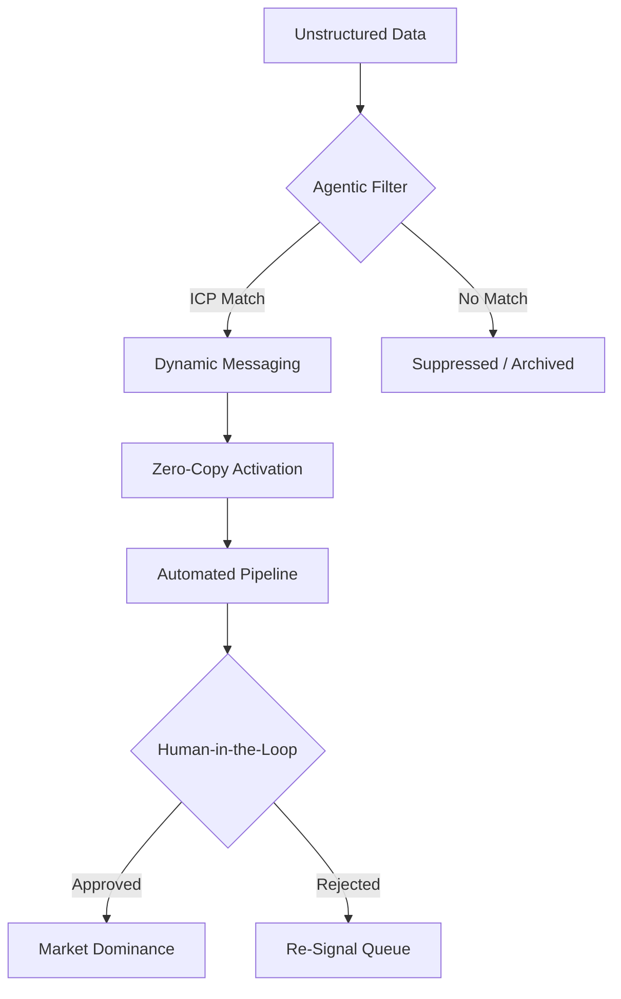

# 🧭 Agentic GTM Operating System (Ag-GTM OS)

> **The transition from Generative AI to Agentic AI requires a shift from "Campaigns" to "Systems."**

This repository is the open-source logic layer for the **Agentic Shift** — a framework developed through 20 years of launching enterprise products at Microsoft, Salesforce, and UiPath.

The frameworks here are not thought leadership. They are operating instructions.

---

## 🛠️ The $100M Pipeline Logic

I architected this model to move beyond "Lead Gen" and into **Deterministic Growth** — a system where every GTM action is governed by data signals, agent logic, and human-in-the-loop approval gates.



---

## 📁 Repository Structure

```
agentic-gtm-os/
├── README.md                          ← You are here
├── frameworks/
│   ├── zero-copy-playbook.md          ← In-Situ Intelligence vs. ETL GTM
│   ├── negative-icp-filter.json       ← The "Onion-Free" qualifier logic
│   └── agentic-workflow-design.md     ← Human-in-the-Loop architecture
├── templates/
│   ├── signal-brief-template.md       ← Single-page signal-to-action doc
│   └── pipeline-audit-template.md     ← Quarterly GTM audit framework
└── secret-ops/
    └── for-substack-readers-only.md   ← High-value prompt for Positioned readers
```

---

## 🔑 Core Principles

### 1. Signals Over Leads
A lead is a guess. A signal is evidence. The Ag-GTM OS operates on signals — behavioral, firmographic, and technographic data processed by agents before a human ever sees a name.

### 2. Zero-Copy Activation
Data should be activated *where it lives*, not where it's been moved. ETL pipelines are a $500M tax on GTM velocity. In-Situ Intelligence eliminates the bottleneck.

### 3. Human-in-the-Loop at Every Gate
Agentic systems don't replace judgment. They compress the time between signal and decision. Every high-stakes action in this OS has an explicit human approval gate.

### 4. The Onion-Free Filter
Named after my core operating principle: **strip every layer of fluff** until you reach the decision-relevant core. The filter removes:
- Vanity metrics (impressions, open rates without conversion)
- Non-ICP leads regardless of volume
- Messaging that explains *what* without *why now*

---

## 📐 The ICP Architecture

The Ideal Customer Profile in the Ag-GTM OS is not a persona card. It is a **probabilistic filter** with hard exclusions.

| Signal Layer | Data Source | Agent Action |
|---|---|---|
| Firmographic | Clearbit / 6sense | Score company fit |
| Technographic | G2 / BuiltWith | Detect stack alignment |
| Behavioral | Website / Product usage | Rank intent |
| Temporal | CRM / Deal history | Assess timing |
| **Negative ICP** | All sources | **Hard suppress** |

The `negative-icp-filter.json` in this repo is the technical implementation of the hard suppress logic.

---

## 🔗 Deep Strategy & Dispatches

Weekly thinking on the Agentic Shift:

- **Website:** [kubersharma.com](https://kubersharma.com)
- **Newsletter:** [Positioned on Substack](https://positioned.substack.com)

---

## 📜 Usage

These frameworks are open-source for a reason: **the best ideas get pressure-tested in public**.

If you use, fork, or adapt anything here:
1. Star the repo so others can find it
2. Reply to the relevant Positioned dispatch with your adaptation
3. Tag me on LinkedIn — I engage with every serious practitioner who builds on this

---

<div align="center">
<sub>Built by Kuber Sharma · No ETL. No Onions. No Guessing.</sub>
</div>
