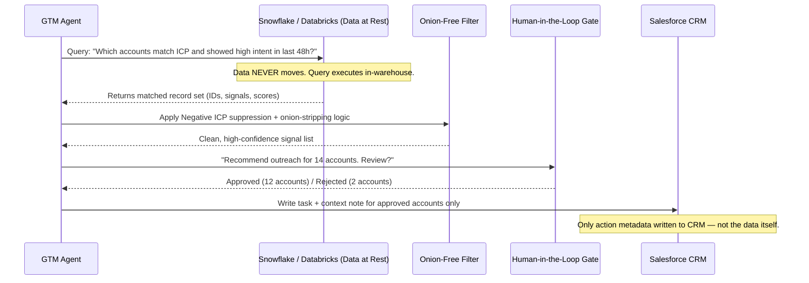

# The Zero-Copy Revolution: A Technical GTM Playbook

**Author:** Kuber Sharma, Senior Director — Platform Product Marketing, UiPath (Ex-Salesforce, Ex-Microsoft)
**Repository:** `agentic-gtm-os/frameworks/zero-copy-playbook.md`
**Status:** Active Framework · v1.0

---

## Executive Summary

For two decades, enterprise GTM operated on a simple (and deeply flawed) assumption: to activate data, you must move data. Marketing teams built ETL pipelines, data warehouses, and reverse-ETL tools to shuttle customer signals from where they lived (Snowflake, Databricks, operational systems) to where campaigns ran (Marketo, Salesforce, HubSpot).

That assumption is now a competitive liability.

**Zero-Copy GTM** is the practice of running intelligence, segmentation, and activation logic *in situ* — inside the data warehouse, without extraction. When your AI agents query Snowflake directly rather than syncing to a marketing platform, you eliminate the latency, the security surface, and the data decay that cripple traditional GTM.

This playbook is the operating manual for making that shift.

---

## The ETL Tax: What Traditional GTM Actually Costs

Before we define Zero-Copy, it's worth naming precisely what we're replacing.

Traditional GTM data pipelines work like this:

1. Customer behavior data lands in Snowflake or Databricks
2. Reverse-ETL tools (Census, Hightouch) extract and sync subsets to CRM/MAP
3. Marketing teams build campaigns against this *copy* of the data
4. By the time a rep sees a signal, it's 24–72 hours old and partially stale
5. The security team audits three more systems instead of one

This is the ETL Tax. It's measured in time, security risk, and — most importantly — **precision loss**.

---

## Traditional GTM vs. Zero-Copy GTM

| Dimension | Traditional GTM | Zero-Copy GTM |
|---|---|---|
| **Time-to-Value (TTV)** | 24–72 hours (sync lag) | Near real-time (query at signal time) |
| **Data Freshness** | Stale at activation | Live at activation |
| **Security Surface** | Data in N+1 systems | Data in 1 system |
| **Security Friction** | High — multiple DPAs, audit logs | Low — single governance layer |
| **ICP Precision** | Segment-level (broad) | Record-level (exact) |
| **Compliance Overhead** | Multiply by each destination tool | Contained to source warehouse |
| **Infrastructure Cost** | Reverse-ETL licenses + MAP storage | Warehouse compute only |
| **GTM Agility** | Change requires pipeline rebuild | Change is a query edit |
| **Agent Compatibility** | Fragmented (each tool = separate agent) | Unified (agents query one source) |
| **The Onion Metric** | Many layers before signal → action | Zero layers. Signal IS the action trigger. |

---

## In-Situ Intelligence: The Architecture

In-Situ Intelligence means your GTM logic runs *where the data lives*, not where you moved it.

**What this diagram shows:**
- The warehouse is queried, not emptied
- Agent logic runs on the result set, not a copy
- The CRM receives *action instructions*, not *data exports*
- The human gate approves *decisions*, not *data movements*

---

## The Onion-Free Filter

The Onion-Free Filter is the qualification logic that sits between raw signal and human-visible recommendation. It exists because most GTM systems suffer from **Onion Architecture**: layers upon layers of qualification criteria that, when peeled back, reveal... nothing worth acting on.

The filter has three passes:

### Pass 1: Hard Negative ICP Suppression
Before any enrichment or scoring, remove records that match hard-exclusion criteria:
- Company size outside viable range (too small to buy, too large for current motion)
- Industry verticals with known low win rates
- Accounts already in a disqualified/churned state in CRM
- Geographic exclusions

### Pass 2: Signal Decay Check
A signal from 30 days ago is an onion layer. Remove it.
- Intent signals older than the configured freshness window are suppressed
- Behavioral signals with no corresponding firmographic match are suppressed
- Spike signals (one-time page views, single event registrations) require corroboration

### Pass 3: Deterministic Scoring
What remains after Passes 1 and 2 is scored on a simple, auditable rubric:
- **Fit Score** (firmographic + technographic): 0–50 points
- **Intent Score** (behavioral signals): 0–30 points
- **Timing Score** (contract proximity, hiring signals, news triggers): 0–20 points
- **Minimum threshold for human review:** 65/100

Only records above threshold reach the Human-in-the-Loop gate.

---

## Implementation Playbook: 90-Day Activation

### Days 1–30: Warehouse Audit & Baseline
- [ ] Identify all GTM-relevant tables in Snowflake/Databricks
- [ ] Map current reverse-ETL flows and their latency profiles
- [ ] Define your Negative ICP criteria (input into `negative-icp-filter.json`)
- [ ] Set freshness windows per signal type

### Days 31–60: Agent Architecture
- [ ] Deploy read-only GTM agent with warehouse query permissions
- [ ] Build the Onion-Free Filter as a warehouse-native stored procedure or dbt model
- [ ] Establish Human-in-the-Loop approval workflow (Slack/email gate)
- [ ] Run parallel pilot: Zero-Copy segment vs. traditional segment, same campaign

### Days 61–90: Optimization & Scale
- [ ] Measure TTV delta between Zero-Copy and traditional motions
- [ ] Tune scoring weights based on conversion data
- [ ] Document suppression logic for compliance team
- [ ] Publish internal case study with pipeline attribution data

---

## The Practitioner's Reality Check

Zero-Copy GTM is not a product you buy. It's an architectural decision you make. It requires:

1. **A centralized warehouse** (Snowflake, Databricks, BigQuery) — if your data is still in spreadsheets and siloed CRMs, start there
2. **Agent infrastructure** with warehouse query capability — Cortex Analyst, Databricks AI, or custom tooling
3. **Organizational will** to give GTM teams read access to the data warehouse — this is the political challenge, not the technical one

The technical implementation is straightforward. Getting your data governance team comfortable with "marketing agents in the warehouse" is the real 90-day project.

---

## Further Reading

- [Positioned (Substack)](https://positioned.substack.com) — Weekly dispatches on Agentic GTM
- [kubersharma.com](https://kubersharma.com) — Strategic writing and advisory
- [`negative-icp-filter.json`](../negative-icp-filter.json) — The technical implementation of Pass 1

---

Part of the Agentic GTM OS · Built by Kuber Sharma · No ETL. No Onions.

